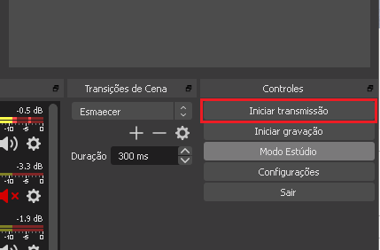
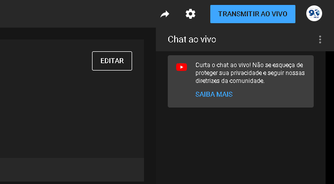

# Transmissão

Guia e orientações para a transmissão ao vivo do culto em Blumenau.

Este guia segue um passo a passo de como executar a transmissão ao vivo de um culto.
Para ver mais detalhes sobre alguma área da transmissão, veja os guias específicos abaixo:

- [ATEM Mini](./atem-mini.md)
- [Áudio](./audio.md)
- [Câmeras](./cameras.md)
- [Luzes](./luzes.md)
- [Slides e Projeção](./slides.md)
- [Softwares](./software.md)
- [Sonoplastia](./sonoplastia.md)

## Preparação

1. Verificar as questões de energia:
   - Garantir que o No-Break está ligado;
   - Ligar as duas réguas na mesa que alimentam computador, câmeras e ATEM Mini.

2. Ligar o hardware de áudio:
   - Hoje existe uma peça responsável por captar o áudio da mesa e dos microfones.
   Para ligá-la, basta apertar o botão que fica atrás na peça;
   - Para regulagem do som vindo da mesa, veja a seção [Áudio](./audio.md).

3. Ligar a máquina:
   - Ligue o computador;
   - Ligue os monitores;
   - Digite a senha.

4. Ligar as câmeras:
   - Para ligar as câmeras, basta abrir a lateral e conectar os cabos correspondentes;
   - É interessante verificar se a lentes estão limpas. Você pode usar um pano de tecido ou um pedaço de papel higiênico para limpá-las.

5. Ligar a [BlackMagic ATEM Mini](./atem-mini.md).

6. Ligar a TV:
   - Abaixo do mezanino existe uma TV virada para o palco que é utilizada como retorno.

7. Ligar as [luzes do palco](./luzes.md)

8. Equipamentos ligados! É hora de configurar os programas...

## Configuração

> Para regulagens de áudio, veja mais detalhes [aqui](./audio.md).

1. Seleção de cenas:
   - Toda a parte de seleção de câmeras e projetor acontece na [ATEM Mini](./atem-mini.md)
   - Demais cenas são utilizadas somente para vídeos exclusivos da transmissão (que não devem ir para o projetor, por exemplo)

2. Abrir o [OBS Studio](./software.md#obs-studio):
   - Para que o palco veja o que está sendo transmitido, clique com o botão direito sob a imagem sendo enviada (programa):
     - `Projetor em tela inteira (programa)` > `Monitor 2`
   - Assim como a tela do mezanino, também os projetor devem projetar o programa:
     - `Projetor em tela inteira (programa)` > `Monitor 3`
       > No caso de um conteúdo diferenciado para os projetores, enviar o conteúdo da cena ATEM em vez de programa e selecionar a cena 3 na ATEM
   - Verificar que o sinal das câmeras está chegando
   - Verificar que o sinal do projetor está chegando
   - Para regulagem avançada de cenas e transmissão, veja [Software - OBS Studio](./software.md#obs-studio)

3. Abrir o [ATEM Software Control](./software.md#atem-software-control):

4. Abrir o Google Chrome / YouTube:
   - A página de transmissão pode ser acessada [aqui](https://studio.youtube.com/channel/UCD9zslKV3jrJb3pslWe32Bw/livestreaming/dashboard)
   - Se for questionado, clonar a configuração de um culto anterior
   - Verificar agendamento para o dia
   - Configurar título, horário, imagem
   - **IMPORTANTE**: O culto deve ser marcado como "Não é para crianças" e em avançado para "Não restringir conteúdo"
     

## Iniciando

- No [OBS Studio](./software.md#obs-studio), clicar em em `Iniciar transmissão`;
  
  > **IMPORTANTE:** essa etapa já pode ser iniciada minutos antes, pois somente com o próximo passo que a transmissão realmente inicia no YouTube.
- No [YouTube](https://studio.youtube.com/channel/UCD9zslKV3jrJb3pslWe32Bw/livestreaming/dashboard), clicar em `Transmitir ao vivo`.
  
