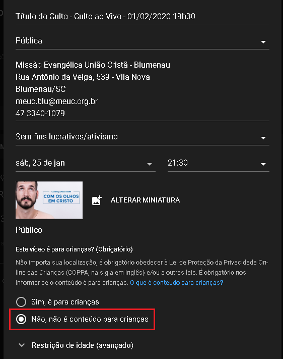

# Transmissão

Guia e orientações para a transmissão ao vivo do culto em Blumenau.

Este guia segue um passo a passo de como executar a transmissão ao vivo de um culto.
Para ver mais detalhes sobre alguma área da transmissão, veja os guias específicos abaixo:

- [Áudio](./audio.md)
- [Cabos e Entradas](./cabos-e-entradas.md)
- [Hardware](./hardware.md)
- [Software](./software.md)

## Preparação

1. Verificar as questões de energia:
   - Garantir que o No-Break está ligado;
   - Ligar as duas réguas na mesa que alimentar computador e câmeras.

2. Ligar o hardware de áudio:
   - Hoje existe uma peça responsável por captar o áudio da mesa e dos microfones.
   Para ligá-la, basta apertar o botão que fica atrás na peça;
   - Para regulagem do som vindo da mesa, veja a seção [Áudio](./audio.md).

3. Ligar as câmeras:
   - Para ligar as câmeras, basta abrir a lateral e conectar os cabos correspondentes;
   - É interessante verificar se a lentes estão limpas. Você pode usar um pano de tecido ou um pedaço de papel higiênico para limpá-las.

4. Ligar a máquina:
   - Ligue o computador;
   - Digite a senha.

5. Equipamentos ligados! É hora de configurar os programas...

## Configuração

> Para regulagens de áudio, veja mais detalhes [aqui](./audio.md).

1. Abrir o [OBS Studio](./software.md#obs-studio):
   - Para ter visibilidade de todas as cenas, abrir o Multiview...
     - `Mostrar` > `Visualização múltipla (tela inteira)` > `Monitor 2`
   - Se houver um monitor apontando para o palco, você pode clicar com o botão direito na imagem sendo transmitida e...
     - `Projetor em tela inteira (programa)` > `Monitor 3`
   - Verificar que o sinal das câmeras está chegando
   - Verificar que o sinal do projetor está chegando
   - Para regulagem avançada de cenas e transmissão, veja [Software - OBS Studio](./software.md#obs-studio)

2. Abrir o Google Chrome / YouTube:
   - A página de transmissão pode ser acessada [aqui](https://studio.youtube.com/channel/UCD9zslKV3jrJb3pslWe32Bw/livestreaming/dashboard)
   - Se for questionado, clonar a configuração de um culto anterior
   - Verificar agendamento para o dia
   - Configurar título, horário, imagem
   - **IMPORTANTE**: O culto deve ser marcado como "Não é para crianças" e em avançado para "Não restringir conteúdo"
     

## Iniciando

- No [OBS Studio](./software.md#obs-studio), clicar em em `Iniciar transmissão`;
  
- No [YouTube](https://studio.youtube.com/channel/UCD9zslKV3jrJb3pslWe32Bw/livestreaming/dashboard), clicar em `Transmitir ao vivo`.
  
