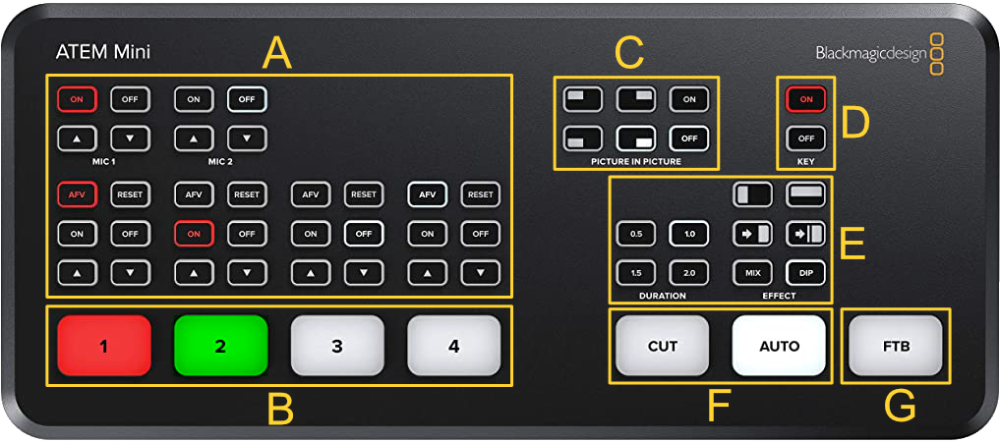

# BlackMagic ATEM Mini

A ATEM Mini é uma mesa de corte de imagem, utilizada nesse momento para a seleção da cenas entre as câmeras e o computador da projeção.  
Basicamente ela tem várias entradas de vídeo (HDMI) e seleciona uma saída, com possibilidade de configuração e processamento em cima das imagens.

Abaixo segue um resumo das principais funções do dispositivo:

## A - Som

> **IMPORTANTE:** Não utilizamos essa funcionalidade

Além da seleção de imagem, a ATEM tem possibilidade de transmitir áudio individualmente para cada canal e volume.  
Mas no nosso caso, todo o áudio vem diretamente da mesa de som, sem utilizar a ATEM.

# B - Vídeo

Essa é a parte mais importante!

Os números 1-4 indicam as entradas de vídeo da mesa.  
O canal selecionado em vermelho é o canal ativo, e o canal verde é o canal em Preview.

> Nesse momento o segundo monitor na mesa está sendo utilizado na saída da ATEM para Preview.

Nesse momento, a configuração é:

- 1: Câmera esquerda - Principal
- 2: Câmera direita - Aberta
- 3: Computador da projeção

> O canal 4 não está sendo usado neste momento, mas poderia muito bem abrigar mais um computador ou câmera.

# C - Picture-in-Picture

Use os botões "On" e "Off" para ativar e desativar - respectivamente - a imagem sobreposta no canto esquerdo.

Por configuração no [software](./software.md#atem-software-control), a entrada acima é sempre a **1** (Câmera esquerda - Principal).

> **IMPORTANTE:** Nunca utilize os presets de posição (4 botões da esquerda) - isso remove a configuração manual

# D - Chroma Key

Use os botões "On" e "Off" para ativar e desativar - respectivamente - o chroma key no vídeo selecionado.  
Essa função é utilizada para a legenda das músicas.

Por configuração no [software](./software.md#atem-software-control), a entrada acima com Chroma é sempre a **3** (Computador da projeção).

# E - Tempo e Efeito de Transição

Esses botões permitem alterar o efeito e tempo de transição entre as entradas selecionadas.

> Por padrão, utilize "0.5" para duração e "Mix" para efeito de transição.

# F - Efetivar Transição

Ao apertar um dos botões destacados nessa área é feita a troca da imagem "Oficial" para a que estava em "Preview".

- "CUT" - Corte imediato, sem transição
- "AUTO" - Corte com transição (Recomendado)

# G - Fade to Black

Utilize esse botão para enviar uma imagem preta na saída.  
Raramente utilizado, somente em casos extremos para ocultar/zerar qualquer conteúdo enviado.
