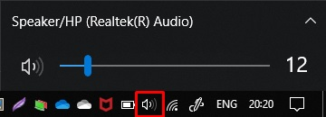
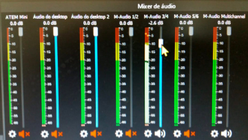

# Áudio

> **IMPORTANTE:** para melhor qualidade e isolamento do som do computador, recomendamos levar seu próprio fone de ouvido. Um cabo mais longo também pode ser útil.

## Mesa de som

É recomendado que a regulagem individual dos instrumentos seja feita pelo sonoplasta.  
Mas é possível utilizar o software [TF Editor](sonoplastia.md#tf-editor) para ajustes.

Em resumo:

- O som da mesa é enviado para um canal estéreo de retorno (9/10)
- O canal é capturado pela FastTrack Ultra que recebe via USB
- Os canais são considerados como um microfone pelo computador
- No [OBS Studio](./software.md#obs-studio), esse microfone fica aberto e envia o áudio também para os fones de ouvido

## Perguntas e problemas frequentes

### Qual das entradas de áudio (microfone) recebe o som da mesa?

Hoje utilizamos a placa de áudio externa M-Audio para captar o som, nos canais 3/4.  
O nome deve ser algo parecido com `M-Audio 3/4`.

### Não consigo ouvir o som no OBS

Alguns problemas diferentes podem ser as causas. Verifique os itens da lista abaixo para garantir que funcione:

1. O fone está conectado na saída de áudio correta?  
   Somente a saída na parte **traseira** do gabinete (destacada por ser de cor diferente) funciona.
2. A saída selecionada no Windows está correta?  
   No canto inferior direito, no símbolo de som, selecione "Fone de Ouvido"  
   
3. A saída de monitorameno no OBS está correta?  
   Você pode conferir em "Configurações" &gt; "Áudio" &gt; "Avançado" &gt; "Dispositivo de monitoramento". Deve estar selecionada a opção "Padrão"
4. Abra o OBS somente **após** os passos anteriores estarem corretos. Reinicie o OBS caso já tenha iniciado.  
   O OBS utiliza a saída padrão do Windows para o som de retorno. Acesse qualquer outro áudio para garantir que o fone esteja funcionando (ex. Vídeo no YouTube)
5. A placa de som está recebendo áudio?  
   Verifique se a placa externa ao computador está conectada e os leds estão acesos ou piscando conforme a variação do som (verde, ou vermelho quando o volume está muito alto).  
   Se não estiverem, verifique com o sonoplasta para que seja corrigido na mesa de som.
6. O canal no OBS está ligado e recebendo sinal da mesa?  
   Na lista de entradas de áudio, a saída padrão da mesa (identificada na pergunta anterior) não deve estar silenciada e deve ver movimento conforme a variação do som.
7. Se todos os passos anteriores foram verificados, veja a pergunta: [Como faço para ouvir o que está sendo transmitido?](#como-faço-para-ouvir-o-que-está-sendo-transmitido)

### O som está metalizado ou com eco

Isso geralmente indica que existe mais de uma fonte no áudio ativa.  
Certifique-se de que o OBS tem somente **UMA** saída de áudio ativa no Mixer de Áudio.

### Como faço para ouvir o que está sendo transmitido?

O [OBS Studio](./software.md#obs-studio) está configurado para transmitir uma entrada de áudio.
Por padrão, o computador deve estar configurado para ouvir essa mesma entrada de áudio.  
Se isso não estiver acontecendo, você pode seguir os seguintes passos:

- No OBS, vá até o canal de áudio que recebe sinal da mesa de som
- Clique na engrenagem
- Selecione "Propriedades de Áudio Avançadas"
- Certifique-se de que o canal esteja marcado como "Enviar e Receber"
  > Se já estiver, desmarque e marque novamente
- Clique em "Aplicar"
