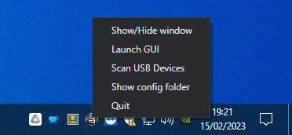

# Cameras

## NeoID PTZ NDI 20x

> [Site oficial](https://neoid.com.br/products/neoidptzndi20x)

Essa câmera tem resolução FullHD (1920 x 1080), zoom óptico de 20x e possibilita controle remoto (PTZ).

Existe um cabo HDMI (~15m) que vai desde a câmera até a entrada 1 da [ATEM Mini](atem-mini.md).

Para utilização do controle, é utilizado o protocolo Visca via cabo de rede.

- A câmera tem IP fixo definido pelo roteador - `172.17.0.4`
- O controle remoto está configurado na Stream Deck a partir do aplicativo [Companion](software.md#companion)

### Controle por StreamDeck

Para facilitar a identificação dos comandos, foi feita uma divisão por cor:

- <b style="color:#4040BF">Azul</b>: Comandos de controle da câmera - movimento, zoom, foco, velocidade  
  
- <b style="color:#BF4040">Vermelho</b>: Comandos para salvar posições da câmera - ao apertar, qualquer posição salva naquele botão é sobrescrita  
  
- <b style="color:#40BF40">Verde</b>: Comandos para chamar posições salvas da câmera  
  

## Sony Handycam HDR-PJ10

> [Site oficial de suporte](https://www.sony.com.br/electronics/support/memory-camcorders-hdr-pj-series/hdr-pj10/manuals)

Essa câmera tem somente conector mini-HDMI, e é conectada à entrada 2 da [ATEM Mini](atem-mini.md).

## Perguntas e problemas frequentes

### Não consigo controlar a câmera PTZ

O software que conecta os botões do StreamDeck com a câmera é o [Companion](./software.md#companion).  
Se os cabos de rede estiverem todos corretamente conectados, tente fechar o Companion - botão direito no ícone > "Quit" - e abrir novamente.

