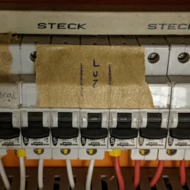

# Luzes

Para melhor iluminação da banda e palestrante, a treliça frontal possui uma série de canhões
de luz que foram posicionados de forma a diminuir sombras e garantir uma boa cor na imagem das
câmeras.

## Canhões de luz

Para ligar os canhões de luz, utilize o acesso à esquerda do palco.  
Lá você encontra um painel de disjuntores.  
Ligue o disjuntor sinalizado com a marcação "Luz".

## Outras luzes

Além dos canhões de luz, é recomendado também que as "Redondas palco" estejam ligadas.  
Para ligá-las use os interruptores próximos à porta de entrada do Hall.
