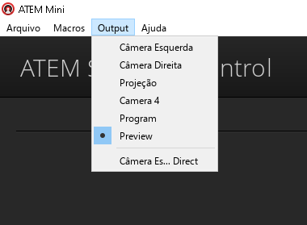
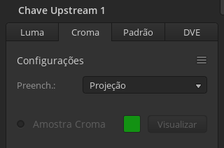
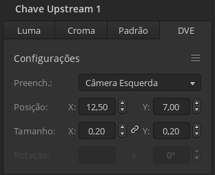

# Software

- [OBS Studio](#obs-studio)
- [ATEM Software Control](#atem-software-control)
  - [Saída de pre-visualização](#saída-de-pre-visualização)
  - [Chroma Key](#chroma-key)
  - [Picture-in-Picture](#picture-in-picture)

## OBS Studio

[Site oficial](https://obsproject.com/)

O OBS Studio é utilizado para transmissão de vídeo e áudio para stream no YouTube e opcionalmente seleção de cenas.

## ATEM Software Control

[Site oficial](https://www.blackmagicdesign.com/products/atemmini/software)

O ATEM Software Control é utilizado para configurações avançadas da ATEM Mini, como tamanho e posição do Picture-in-Picture e detalhes do Chroma Key.

Para as funções dos botões na mesa, acesse a página da [ATEM Mini](atem-mini.md).

### Saída de pre-visualização

O monitor da esquerda está configurado para visualizar uma das entradas da ATEM.  
Por padrão o software vem com a opção "Program" selecionada, que seria a opção selecionada para envio (em vermelho). Porém, recomendamos que a opção "Preview" seja selecionada, para a imagem do monitor apresentar o conteúdo de prévia (em verde).

Essa seleção acontece no menu superior, item "Output".

### Chroma Key

O Chroma Key é utilizado para as legendas de letra das músicas no culto.

Essa configuração pode ser feita no menu lateral direito, aba "Croma".  
A imagem que deve ser jogada por cima deve ser sempre a "Projeção".

> Para evitar uma sombra ou distorção verde, utiliza a configuração de "Borda".

### Picture-in-Picture

O Picture-in-Picture (PiP) é utilizado para ter uma entrada sobreposta a outra.

A configuração do PiP pode ser feita no menu lateral direito, aba "DVE".  
Certifique-se de ter a "Câmera esquerda" selecionada como Preenchimento.

> Recomendamos também deixar a "Opacidade da borda" em 0%.
