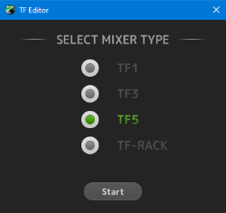
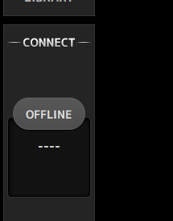
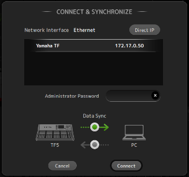
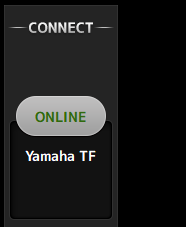
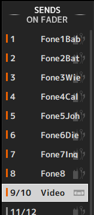
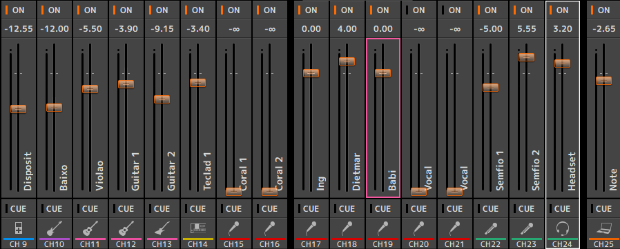

# Sonoplastia

No culto sempre existe alguém designado para configuração de som (sonoplastia),
de preferência sempre deixe o responsável configurar volumes e equalização.

Dito isto, abaixo seguem algumas dicas que podem ajudar durante as programações ou
quando o responsável pelo som não está acessível.

## TF Editor

TF Editor é o software oficial da Yamaha que conecta com diretamente com a mesa de som.

Ao abrir o software, selecione "TF5" (modelo da nossa mesa de som):

### Conectando à mesa

Inicialmente o software não vai estar conectado à mesa.  
Clique em "Offline" na barra lateral esquerda para procurar a mesa.

Se a mesa de som estiver ligada, ela deve logo aparecer na lista.

> Antes de se conectar, certifique-se de que a seta de "Data Sync"
> esteja no sentido "TF5 -> PC"

Após clicar em "Connect", o ícona na lateral deve mudar pra "Online".

### Regulagem do som

Antes de mexer em qualquer volume, selecione o retorno 9/10 no menu lateral direito.  
Esse canal é a saída da mesa utilizada para a transmissão.

Agora você liberdade para a regulagem de volumes para a transmissão!  
Lembra-se porém de sempre manter as vozes nítidas e compreensíveis.

Na imagem abaixo você pode ver o painel de regulagem de som.

Cada canal contém um botão "ON" que liga/desliga o sinal de áudio para a transmissão e
a barra de regulagem de volume.

> **CUIDADO**: O software mantém o último item clicado selecionado e é
> facilmente desregulado com a rolagem do mouse.
